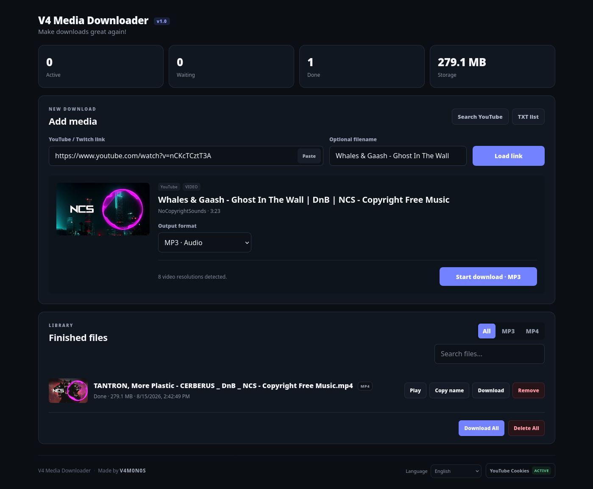

# V4 Media Downloader

Self-hosted web interface for downloading **YouTube videos, YouTube audio, Twitch Clips and Twitch VODs**.
Built with **yt-dlp**, **FFmpeg**, **Flask** and a browser-based UI.



## Features
- YouTube + Twitch
- MP3 and MP4 downloads
- Selectable video quality
- Start / end trimming
- YouTube search
- TXT bulk downloads
- Live progress and queue
- Media library with thumbnails
- Discord webhook notifications
- Optional YouTube cookie import
- German, English and Spanish UI
- File-based community translations
- Automatic systemd service
- Simple install and update scripts

## Quick Install
Designed for **Debian / Ubuntu server** with root access.

Copy and paste:

```bash
wget -qO install.sh https://raw.githubusercontent.com/V4M0N0S/v4-media-downloader/main/install.sh && chmod +x install.sh && ./install.sh
```

Then open:

```text
http://YOUR-SERVER-IP:5000
```

The installer takes care of Python, FFmpeg, Deno, yt-dlp, the virtual environment and the systemd service. If Deno asks for PATH, confirm with Y.

## Manual Install
Download:

```text
install.sh
update.sh
latest.zip
```

Put them into the same directory and run:

```bash
chmod +x install.sh update.sh
./install.sh
```

## Update
After the first installation you can update with:

```bash
./update.sh
```

`update.sh` downloads the newest `latest.zip` from the latest GitHub Release and installs it automatically.

If you no longer have the local updater:

```bash
wget -q https://raw.githubusercontent.com/V4M0N0S/v4-media-downloader/main/update.sh -O update.sh && chmod +x update.sh && ./update.sh
```

## Paths
```text
Application    /opt/v4-media-downloader
Configuration  /etc/v4-media-downloader/config.env
Cookies        /etc/v4-media-downloader/youtube-cookies.txt
Downloads      /var/lib/v4-media-downloader/downloads
Thumbnails     /var/lib/v4-media-downloader/thumbnails
Work files     /var/lib/v4-media-downloader/work
```

## Service
Status:

```bash
systemctl status v4-media-downloader
```

Restart:

```bash
systemctl restart v4-media-downloader
```

Logs:

```bash
journalctl -u v4-media-downloader -f
```

## YouTube Cookies
YouTube can occasionally return:

```text
Sign in to confirm you're not a bot
```

If required, open **YouTube Cookies** at the bottom of the web interface and paste an exported Netscape-format `cookies.txt`.

Cookies are stored at:

```text
/etc/v4-media-downloader/youtube-cookies.txt
```

For export your YT cookie you can use https://github.com/hrdl-github/cookies-txt
or via [Mozilla](https://addons.mozilla.org/en-US/firefox/addon/cookies-txt/)

## Discord
Add your webhook to:

```text
/etc/v4-media-downloader/config.env
```

Example:

```bash
DISCORD_WEBHOOK_URL="https://discord.com/api/webhooks/..."
```

Then restart:

```bash
systemctl restart v4-media-downloader
```

## Translations
Language files are located in:

```text
source/locales/
```

Currently included:

```text
de.json
en.json
es.json
```

New translations can be added as another JSON file. See `TRANSLATING.md`.

## Uninstall
```bash
systemctl disable --now v4-media-downloader
rm -f /etc/systemd/system/v4-media-downloader.service
systemctl daemon-reload
rm -rf /opt/v4-media-downloader
rm -rf /usr/local/lib/v4-media-downloader
```

To also delete configuration and **all downloaded media**:

```bash
rm -rf /etc/v4-media-downloader
rm -rf /var/lib/v4-media-downloader
```

## Disclaimer
Only download media you are allowed to access and save. You are responsible for complying with applicable laws and the terms of the source platform.

## Contributing
🔥 Pull requests are welcome. 

For major changes, please open an issue first to discuss what you would like to change.

## Contact me
☎️ Open an issue or contact me via mail: vamonos@posteo.me or Discord: vamonos.me

## License
👍 [MIT](https://choosealicense.com/licenses/mit/) - Feel free to share, work with it or clone to your own repository!
